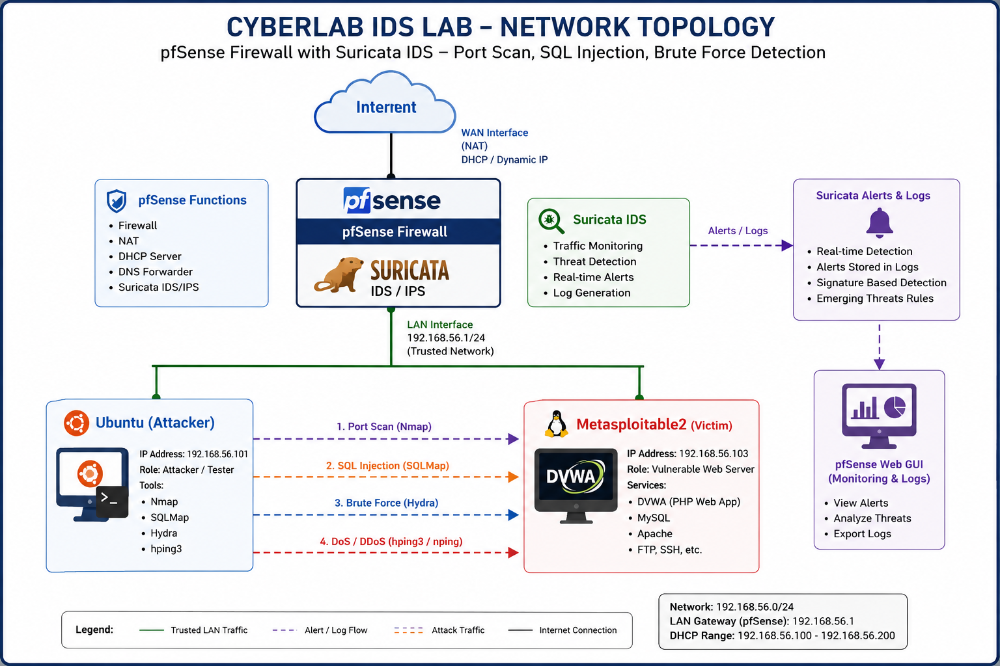
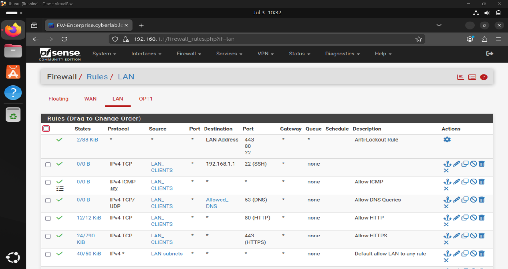
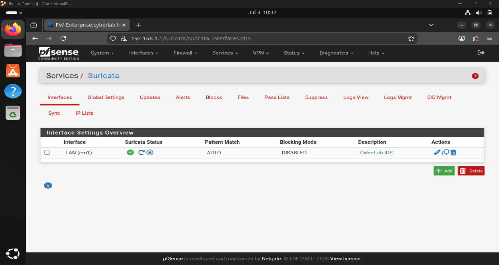
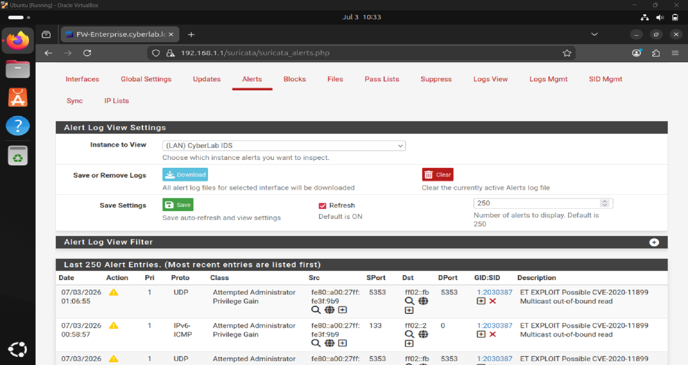
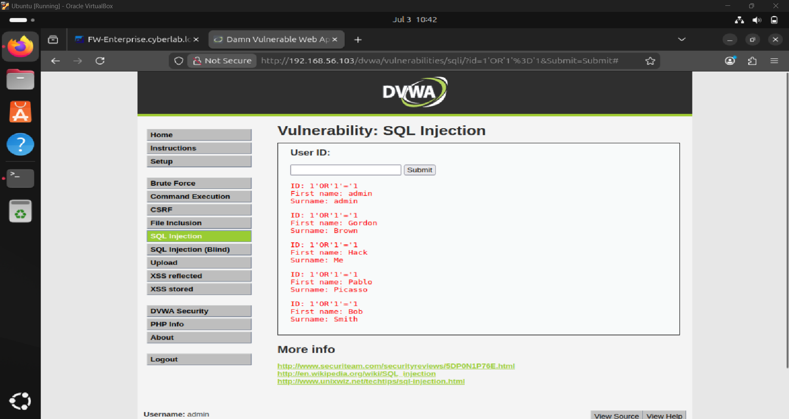

# 🛡️ CyberLab IDS using Suricata & pfSense

Enterprise Network Intrusion Detection System (IDS) Lab built using **pfSense**, **Suricata**, **Metasploitable2**, and **Ubuntu**.

The project demonstrates how to deploy a production-like IDS solution capable of detecting multiple network attacks and generating security alerts for analysis.

---

# Project Overview

This project simulates an enterprise network protected by pfSense Firewall with Suricata IDS installed on the LAN interface.

Different attacks were generated from an attacker machine against a vulnerable server to evaluate the detection capabilities of Suricata.

The generated alerts were collected and analyzed as evidence.

---

# Objectives

- Deploy pfSense Firewall
- Configure Suricata IDS
- Monitor LAN traffic
- Detect common cyber attacks
- Generate IDS alerts
- Analyze attack logs
- Document the complete deployment

---

# Lab Environment

| Device | Role |
|---------|------|
| pfSense | Firewall + IDS |
| Ubuntu | Attacker Machine |
| Metasploitable2 | Vulnerable Target |
| VirtualBox | Virtualization Platform |

---

# Tools Used

- pfSense CE
- Suricata IDS
- VirtualBox
- Ubuntu Linux
- Metasploitable2
- Nmap
- SQLMap
- DVWA
- Wireshark

---

# Network Topology



---

# Network Configuration

| Device | IP Address |
|----------|-------------|
| pfSense LAN | 192.168.1.1 |
| Ubuntu | 192.168.1.101 |
| Metasploitable2 | 192.168.56.103 |

---

# Detected Attacks

✔ Port Scan (Nmap)

✔ SQL Injection

✔ ICMP Scan

✔ TCP Enumeration

✔ Web Attack Detection

---

# Screenshots

## pfSense Dashboard



---

## Suricata IDS



---

## Port Scan Detection



---

## SQL Injection Test



---

# Project Structure

```
CyberLab-IDS-Suricata
│
├── Configurations
│      pfSense configuration
│
├── Logs
│      Suricata Logs
│
├── Screenshots
│      Project Screenshots
│
├── Report
│      Final Documentation
│
└── README.md
```

---

# Deployment Steps

1. Install VirtualBox

2. Deploy pfSense Firewall

3. Configure LAN/WAN interfaces

4. Configure Internet Access

5. Install Suricata Package

6. Download Emerging Threats Rules

7. Enable IDS on LAN Interface

8. Deploy Ubuntu Attacker

9. Deploy Metasploitable2 Target

10. Generate Attacks

11. Monitor Alerts

12. Export Logs

---

# Generated Alerts

The IDS successfully detected:

- ET SCAN Nmap User-Agent
- ET POLICY Suspicious Traffic
- ICMP Detection
- TCP Scan
- Exploit Attempts

---

# Skills Demonstrated

- Network Security
- IDS Deployment
- Firewall Administration
- Traffic Analysis
- Attack Simulation
- Linux Administration
- Threat Detection
- Log Analysis
- Security Monitoring

---

# Files Included

✔ Configuration Files

✔ Logs

✔ Screenshots

✔ Complete Report

---

# Future Improvements

- IPS Mode

- ELK Stack Integration

- SIEM Integration

- Splunk Integration

- Security Onion Deployment

- Custom Suricata Rules

- Automated Reporting

---

# Author

**Abdalkhal**

Cyber Security Student

GitHub:
https://github.com/Abdalkhal

---

# License

This project is intended for educational and research purposes only.
